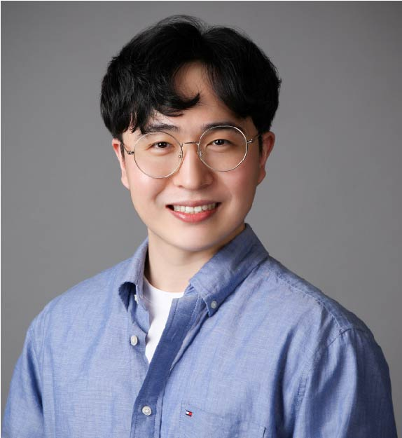

# **Dongjin Seo**

<!--
include contact information from the front matter
Supported arguments:
    - homepage: url, text
    - phone
    - email
-->


<p align="center">

</p>



Hi. I am Dongjin Seo, a student @[KAIST EE](https://ee.kaist.ac.kr). I have a dream of contributing to the world in any way(academic or industrial) to make it a better place. My research interest is mostly based on **application of Machine Learning** and **Machine Learning theory** itself. From my Bachelor and Master degree, I also acquired experience in **semiconductor** and **photonics**, respectively. I sometimes enjoy my life by playing the piano, especially with my taste on **Jazz**. [Take a look!](https://soundcloud.com/dongjin-seo-743442835) 

## Education

### **Korea Advanced Institute of Science and Technology** `2021.9 -`

```
Daejeon, South Korea
```

- Ph.D. in Electrical Engineering
- Academic Advisor: [Changho Suh](http://csuh.kaist.ac.kr/)
- Research Interest:
  1. Explaninable AI
  2. Fair Learning
  3. Meta Learning

### **Korea Advanced Institute of Science and Technology** `2019.2 - 2021.2`

```
Daejeon, South Korea
```

- M.S. in Electrical Engineering
- Academic Advisor: [Minseok Jang](http://jlab.kaist.ac.kr/)
- What I performed: 
  1. optimization of metasurface structure based on Reinforcement Learning
  2. prediction of optical device behavior via Machine Learning
  3. design of PCB board for optical experiments with Si substrate
- [Thesis](http://jlab.kaist.ac.kr/documents/team/dongjinseo_MS_thesis_2021_Spring.pdf)

### **Korea Advanced Institute of Science and Technology** `2011.2 - 2019.2`

```
Daejeon, South Korea
```

- B.S. in Electrical Engineering
- Special Interest in **Semiconductor Technology** (All A's acquired from the subject)

## Publications

### **Structural optimization of 1D freeform metagrating deflector via deep reinforcement learning**
**Dongjin Seo**&dagger;, Daniel Wontae Nam&dagger;, Juho Park, Chan Y. Park, and Min Seok Jang.
_ACS Photonics 2021, under review_

### **Inverse design of organic light-emitting diode structure based on deep neural networks**
Sanmun Kim, ... **Dongjin Seo**, ... Chan Y. Park, and Min Seok Jang.
_Nanophotonics 2021, under review_

<!--

### [**Penrose: From Mathematical Notation to Beautiful Diagrams**](http://penrose.ink/media/Penrose_SIGGRAPH2020.pdf)
Katherine Ye, **Wode Ni**, Max Krieger, Dor Ma'ayan, Joshua Sunshine, Jonathan Aldrich, and Keenan Crane.<br> 
_ACM Transactions on Graphics (SIGGRAPH'20)._<br>
[[PDF](http://penrose.ink/media/Penrose_SIGGRAPH2020.pdf)]
[[BibTeX]({{ page.homepage.url }}/assets/siggraph20-penrose.txt)]
[[www](http://penrose.ink/siggraph20.html)]
[[repo](https://github.com/penrose/penrose)]

### [**How Domain Experts Create Conceptual Diagrams and Implications for Tool Design**]({{ page.homepage.url }}/assets/chi-20-natural-diagramming.pdf)

Dor Ma'ayan\*, **Wode Ni\***, Katherine Ye, Chinmay Kulkarni, and Joshua Sunshine.<br>
<i class="fas fa-award"></i> <strong>Best Paper Honourable Mention</strong><br>
_In Proceedings of the 2020 CHI Conference on Human Factors in Computing Systems (CHI'20)._<br>
[[PDF]({{ page.homepage.url }}/assets/chi-20-natural-diagramming.pdf)]
[[BibTeX]({{ page.homepage.url }}/assets/chi-20-natural-diagramming.txt)]

### [**Defining Visual Narratives for Mathematics Declaratively**](http://plateau-workshop.org/assets/papers-2019/9.pdf)

Max Krieger, **Wode Ni**, and Joshua Sunshine.<br>
_Evaluation and Usability of Programming Languages and Tools (PLATEAU 2019), co-located with UIST._<br>
[[PDF](http://plateau-workshop.org/assets/papers-2019/9.pdf)]
[[slides]({ page.homepage.url }}/aassets/plateau-19-presentation.pdf)]

### [**Designing Declarative Language Tutorials: a Guided and Individualized Approach**](http://plateau-workshop.org/assets/papers-2019/2.pdf)

Anael Kuperwajs Cohen, **Wode Ni**, and Joshua Sunshine.<br>
_Evaluation and Usability of Programming Languages and Tools (PLATEAU 2019), co-located with UIST._<br>
[[PDF](http://plateau-workshop.org/assets/papers-2019/2.pdf)]
[[slides]({{ page.homepage.url }}/assets/plateau-19-presentation.pdf)]

---

### [**Substance and Style: domain-specific languages for mathematical diagrams**](https://2017.splashcon.org/event/dsldi-2017-substance-and-style-domain-specific-languages-for-mathematical-diagrams)

**Wode Ni\***, Katherine Ye\*, Joshua Sunshine, Jonathan Aldrich, and Keenan Crane.<br> _Domain-Specific Language Design and Implementation (DSLDI 2017), co-located with SPLASH._ <br>
[[PDF]({{ page.homepage.url }}/assets/dsldi.pdf)]
[[slides]({{ page.homepage.url }}/assets/dsldi-presentation.pdf)]
[[www](http://penrose.ink)]
[[repo](https://github.com/penrose/penrose)]

### [**Whiteboard Scanning Using Super-Resolution**](http://scholar.dickinson.edu/student_honors/221/)

**Wode Ni**.<br> _Dickinson College Honors Theses. Paper 221._<br>
[[PDF]({{ page.homepage.url }}/assets/superres.pdf)]
-->

## Experience

### **SK hynix Internship** `2018.6~2018.8`
Subject: _NAND Flash Device research in QLC Device Team_

### **2020 Venture Research Program for Master’s and PhD Students in the College of Engineering** `2020.5~2020.12`
Subject: _Inverse Design of Manufacturable 2D Polarization Conversion Plasmonic Metasurface Using Electromagnetic Simulation and Reinforcement Learning_,
As the first and a main contributor

### **KC ML2** `2021.2 - 2021.8`

_Research Resident_
Worked with [ML2 team](https://www.kc-ml2.com/?gclid=CjwKCAjwxo6IBhBKEiwAXSYBs69gYzkNCl6JRq55vhYAVfQKp_MfvDtBOExd7rzzJ9RapZ97ftr9dRoCpgIQAvD_BwE)

<!--
### **Microsoft Research** `2020.5 - 2020.8`

_Research Intern_<br>
Worked with the [PROSE](https://www.microsoft.com/en-us/research/group/prose/) team (mentored by [Titus Barik](https://www.barik.net/)) on improving developer productivity in Visual Studio Code. I interviewed developers to elicit their needs for code transformation tools in editors. Inspired by the empirical data and relevant work in program synthesis, I designed **reCode**, an interaction model for rapidly performing complex code transformation using the familiar find-and-replace experience.

### **Carnegie Mellon University, Research Experiences for Undergraduate** `2017.5 - 2017.8`

_Research Assistant_<br>
**Penrose** is a system that automatically visualizes mathematics using two domain-specific languages: **Substance** and **Style**. Co-advised by [Jonathan Aldrich](https://www.cs.cmu.edu/~./aldrich/), [Keenan Crane](https://www.cs.cmu.edu/~kmcrane/), [Joshua Sunshine](http://www.cs.cmu.edu/~jssunshi/), and [Katherine Ye](https://www.cs.cmu.edu/~kqy/), I designed and implemented the Style language, and extended the Substance language to support functions and logically quantified statements.

### **Columbia University, Computer Graphics and User Interfaces Lab** `2017.1 - 2017.5`

_Research Assistant_<br>
Worked with prof. Steven Feiner, on **Cyber Affordance Visualization in Augumented Reality** project. Developed a Microsoft Hololens application that visualizes the Columbia campus in AR environment.

-->

## Mentoring
<!--
Hwei-Shin Harriman (Olin College of Engineering, independent research) `CMU, 2021` <br>
Max Krieger (CMU, independent research & [REUSE](https://www.cmu.edu/scs/isr/reuse/)) `CMU, 2018 - Now` <br>
Courtney Miller (New College of Florida, [REUSE](https://www.cmu.edu/scs/isr/reuse/)) `CMU, 2019` <br>
Anael Kuperwajs Cohen (Macalester College, [REUSE](https://www.cmu.edu/scs/isr/reuse/)) `CMU, 2019` <br>

---
-->
## Honors & Awards

### **Exemplary Soldier Award** `2016.5`
Guard of Government Complex Daejeon

### **Best Paper Award** Horonable Mention `2017.9`
KAIST School of Humaninites & Social Sciences


<!--
CHI'20 Best Paper Honourable Mention Award `CMU, 2020` <br>
Phi Beta Kappa `Dickinson, 2018` <br>
Excellence in Computer Science Award `Columbia, 2018` <br>
Travel Award PL Mentoring Workshop (PLMW) `SPLASH, 2018` <br>
Tau Beta Pi, Engineering Honor Society `Columbia, 2017` <br>
Computer Science Departmental Honors `Dickinson, 2016` <br>
Pi Mu Epsilon, Mathematics Honor Society `Dickinson, 2016` <br>
Upsilon Pi Epsilon, Computer Science Honor Society `Dickinson, 2016` <br>
Alpha Lambda Delta, First year Honor Society `Dickinson, 2013`<br>
John Montgomery Scholarship `Dickinson, 2013` <br>
-->
## Teaching
<!--
Teaching Assistant, **Programming Languages and Translators (COMS 4115)** `Columbia, 2017 - 2018` <br>
Teaching Assistant, **Introduction to Java II (COMP 132)** `Dickinson, 2016` <br>
Peer Tutor, **Data Structures and Problem Solving (COMP 232)** `Dickinson, 2016` <br>
Computer Lab Consultant `Dickinson, 2014 - 2016` <br>
-->

## Service

### Korea Military Service `2014.8 - 2016.5`
_AUxilliary Police_


<!--
Sub-reviewer `OOPSLA'21, VL/HCC'21` <br>
Reviewer `CHI 2021` <br>
Research Experiences for Undergraduates in Software Engineering Admission Committee `CMU, 2019 - 2021` <br>
-->
<!--
### Footer

Last updated: July 2021
-->
